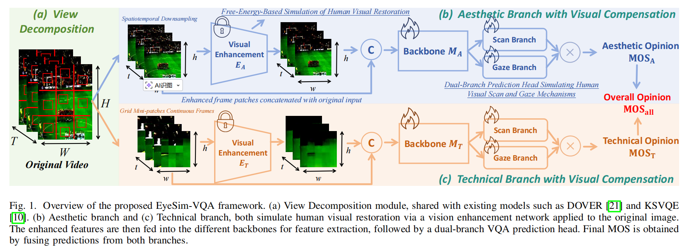
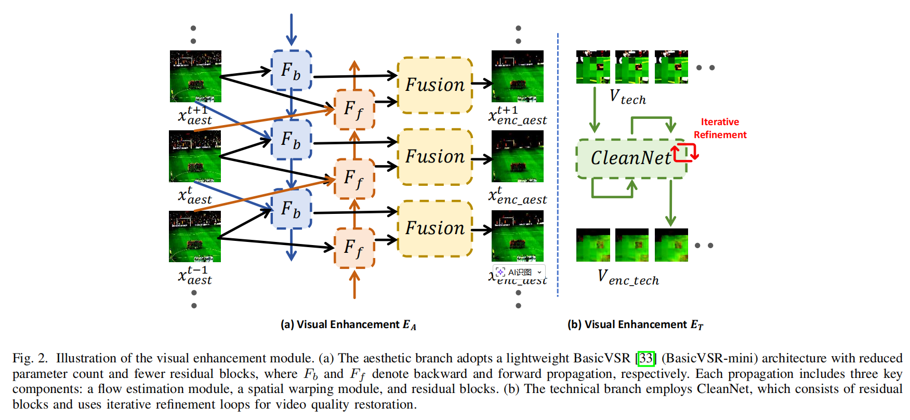
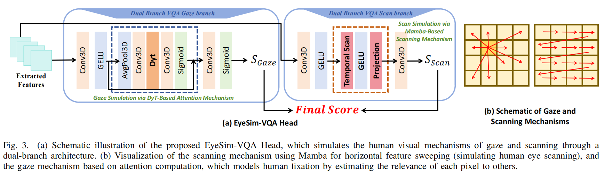

# EyeSimVQA （TCSVT2026） 
This repository contains the official implementation of **EyeSimVQA**:  
**EyeSim-VQA: A Free-Energy-Guided Eye Simulation Framework for Video Quality Assessment**  
**Authors**: Zhaoyang Wang,  Wen Lu, Jie Li, Lihuo He, Maoguo Gong, Xinbo Gao

---

## 🧠 Overview

Modeling visual perception in a manner consistent with human subjective evaluation has become a central direction in both video quality assessment (VQA) and broader visual understanding tasks. While free-energy-guided self-repair mechanisms—reflecting human observational experience—have proven effective in image quality assessment, extending them to VQA remains non-trivial. In addition, biologically inspired paradigms such as holistic perception, local analysis, and gaze-driven scanning have achieved notable success in high-level vision tasks, yet their potential within the VQA context remains largely underexplored.
To address these issues, we propose EyeSimVQA, a novel VQA framework that incorporates free-energy-based self-repair. It adopts a dual-branch architecture, with an aesthetic branch for global perceptual evaluation and a technical branch for fine-grained structural and semantic analysis. Each branch integrates specialized enhancement modules tailored to distinct visual inputs—resized full-frame images and patch-based fragments—to simulate adaptive repair behaviors. We also explore a principled strategy for incorporating high-level visual features without disrupting the original backbone. In addition, we design a biologically inspired prediction head that models sweeping gaze dynamics to better fuse global and local representations for quality prediction.
Experiments on five public VQA benchmarks demonstrate that EyeSimVQA achieves competitive or superior performance compared to state-of-the-art methods, while offering improved interpretability through its biologically grounded design.

---

## 🧱 Network Architecture  






---

## 🚀 Getting Started

### 🔧 Prerequisites

Install the required dependencies from `requirements.txt`:

```bash
pip install -r requirements.txt
```

Our implementation builds upon the DOVER and BasicVSR frameworks. Please refer to their official repositories for detailed environment configuration and installation guidelines.


### 📷 Train the model
Run the scripts:

```bash
python transfer_learning.py -opt script/your.yml -t val-livevqc
```

> **The complete training pipeline is implemented in `transfer_learning.py`, where the YAML configuration file and the target dataset can be specified. Please refer to the script for detailed usage.
> Model parameters and other configuration settings are defined in `Proposed.yml`.**

---

> **More detailed implementation details, including the specific model architecture, can be found in `evaluator.py` under the DOVER directory. In particular, the `IntraRef` module is our newly designed model, developed by extending DOVER with visually enhanced representations.
> For detailed network configurations and parameter settings, please refer to the corresponding definitions in this file.**

---

## 📌 Acknowledgements

This work builds upon the foundations of **Dover**, **BasicVSR** and  **RealBasicVSR**. We sincerely thank the authors of these projects for their valuable contributions and open-source implementations.

---

### 📌 Special Note

The current codebase is not fully standardized or polished, and we kindly ask for your understanding. All key implementation details are contained within the provided files, but some components may require additional configuration depending on your environment or the specific models you intend to run.

If you encounter any difficulties during installation, configuration, or testing, please feel free to open an issue or leave me a message. I will do my best to respond promptly and help resolve the problem.

Thank you for your interest in this work. I sincerely hope that our research can provide new insights and serve as a helpful reference for your own projects.


